# Phase-2 Incident-01 Lab  
## Suspicious Credential Dump Activity on Workstation Pivot

---

## Objective

Simulate attacker transition from initial foothold to credential harvesting capability by exploiting local administrative privilege exposure and performing memory credential access behaviour on a compromised workstation.

This lab generates telemetry required for the Phase-2 incident report.

---

## 🖥 Lab Topology

- **DC01** — Domain Controller  
- **WS01** — Compromised Workstation  
- **ATTACKER** — Kali or Windows attack VM  

---

## Step 0 — Create Suspectible Users (On DC01)

- Create helpdesk_admin

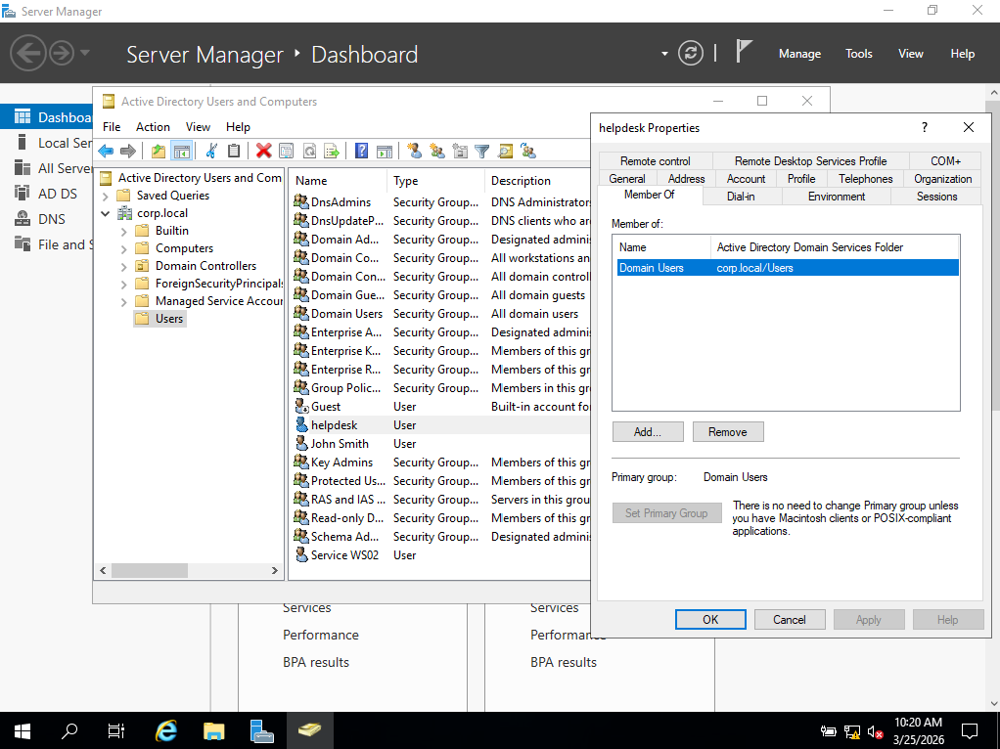

---

## Step 1 — Create Privilege Exposure (On WS01)

- Make helpdesk_admin an administrator in WS01 
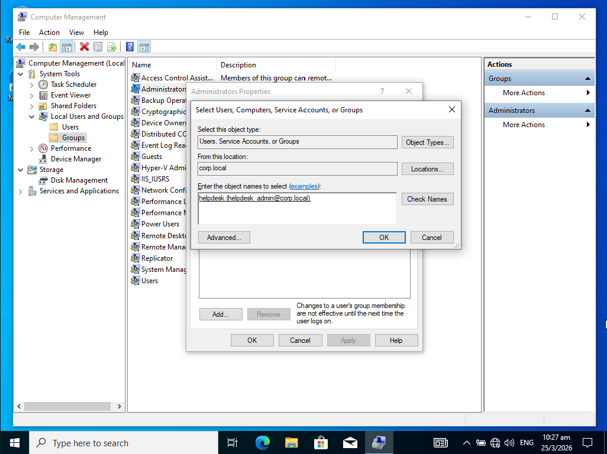

### Reasoning

This simulates real enterprise misconfiguration where support accounts retain persistent local admin privileges.

---

## Step 2 — Enable Security Auditing And Setting Sysmon64 (On WS01) 

- Creating telemetry on WS01 (Logon, Sensitive Privilege, Process Creation)
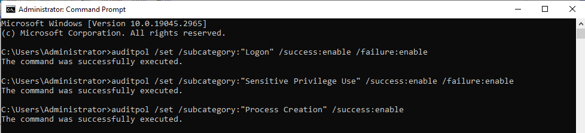

- Setting up Sysmon64 
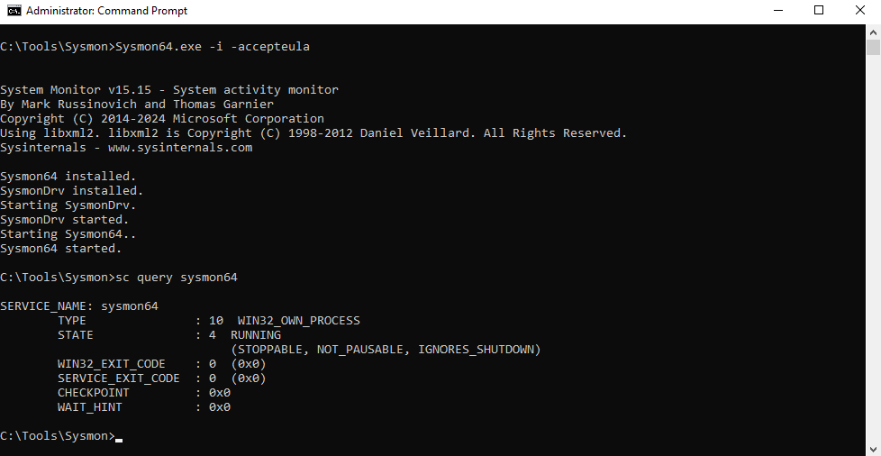
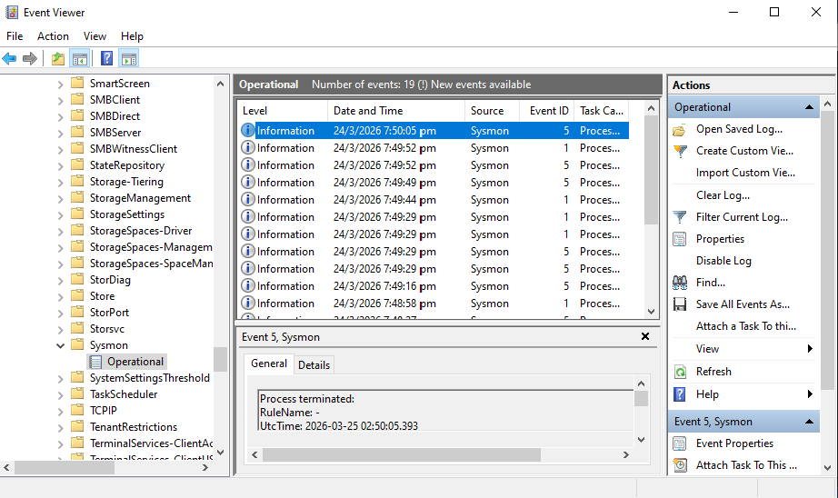

---

## Step 3 — Initial Foothold Simulation

The attacker logs into the compromised workstation using valid domain user credentials.

### Login as Compromised Identity

Login to **WS01** using corp/john

### Establish Host Context

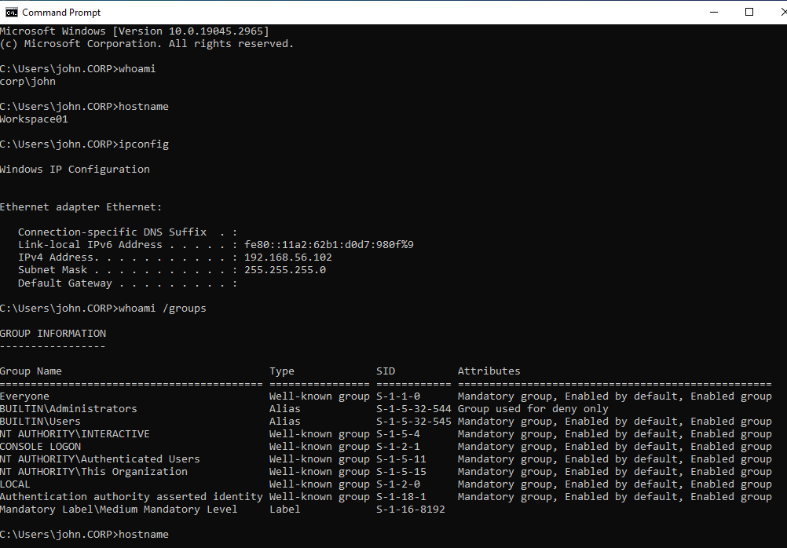

This allows the attacker to determine:

- Current identity context  
- Hostname of compromised pivot  
- Network segment and IP addressing  
- Verify Privilege Level

---

## Step 5 — Privilege Escalation via Administrative Exposure

The attacker discovers that a helpdesk support account has persistent local administrative privileges on the compromised workstation. After obtaining administrative credentials, the attacker aims to establish a full interactive session using the privileged identity.

This enables elevation without exploiting software vulnerabilities.

### Spawn Elevated Context

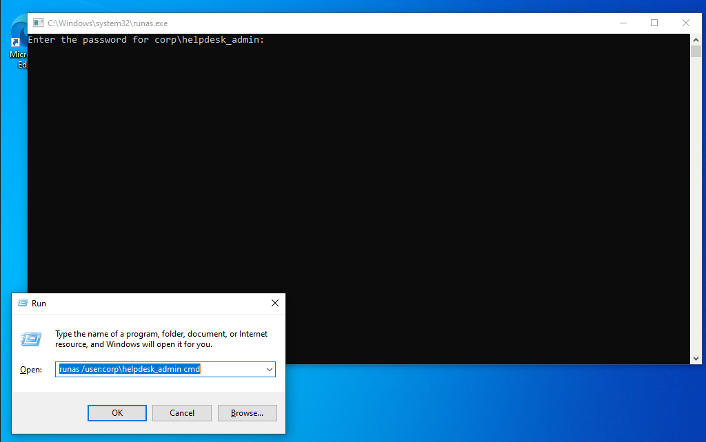
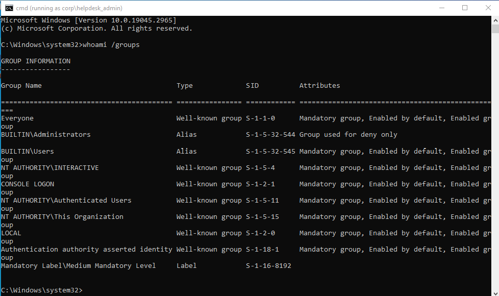

Due to Split Token Model (UAC), the elevated context cmd is showing BUILTIN\Administrator used for deny only. 

Attacker should then pivot into logging in as the identity.
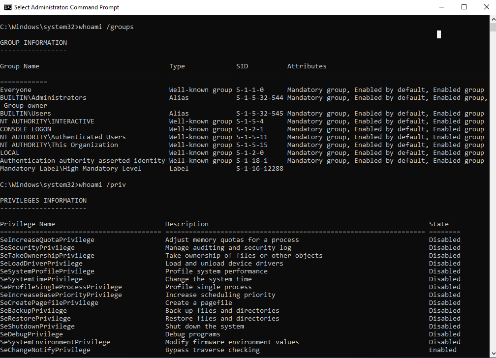

---

## Step 6 — Credential Dump Behaviour Simulation

After obtaining a high-integrity administrative token, the attacker performs credential harvesting by interacting with LSASS memory via task manager (online attack) and mimikatz (by data exfliration and offline parsing).

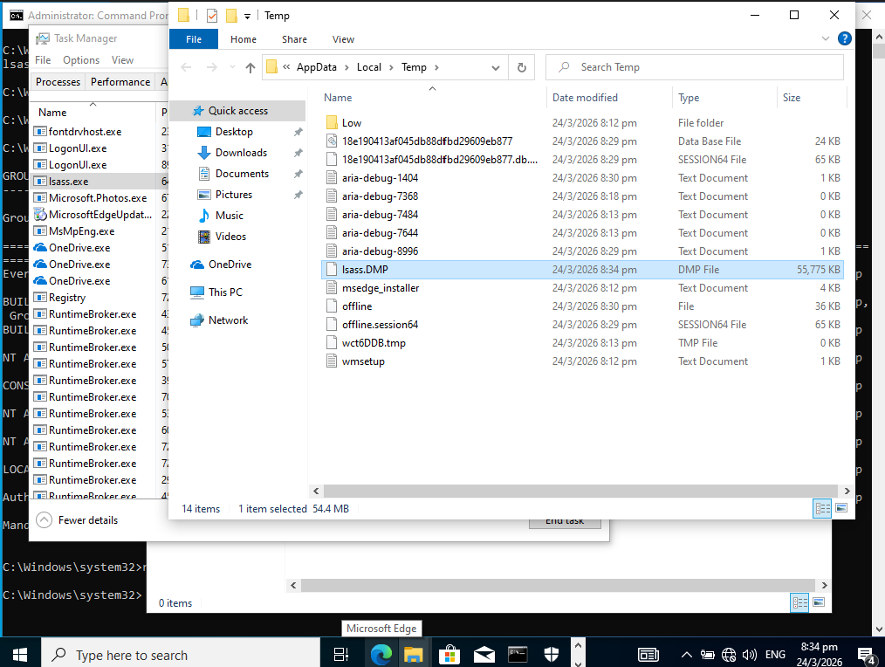
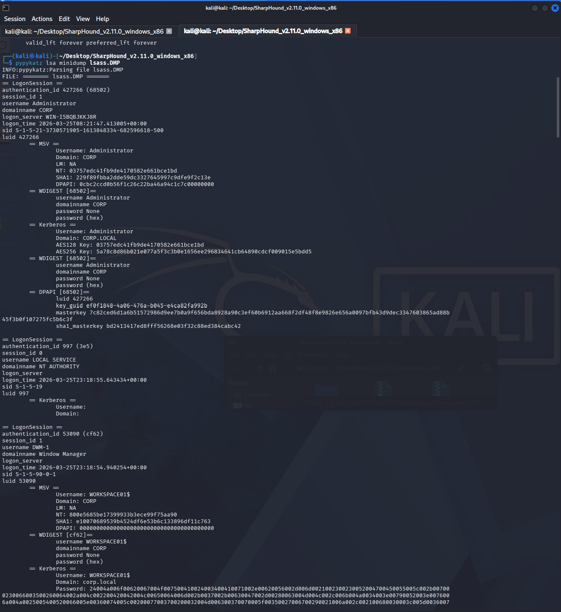

## Step 7 — SOC Analyst Investigation

Following detection of suspicious credential harvesting behaviour, the incident was investigated from a privileged administrative context.

The analyst logged into the affected workstation using a domain administrative account to review security telemetry.

---

### Security Log Analysis

The analyst reviewed authentication and privilege use events to reconstruct attacker activity. Event 4624,4673,4674,4688 are showing.

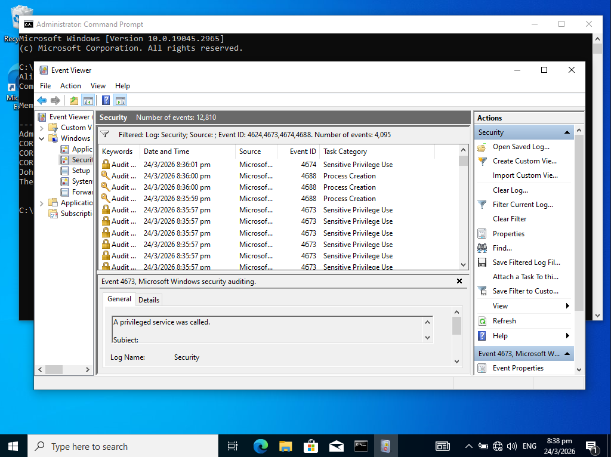
---

### Sysmon Telemetry Analysis

Endpoint telemetry was examined for evidence of LSASS interaction and suspicious process behaviour.

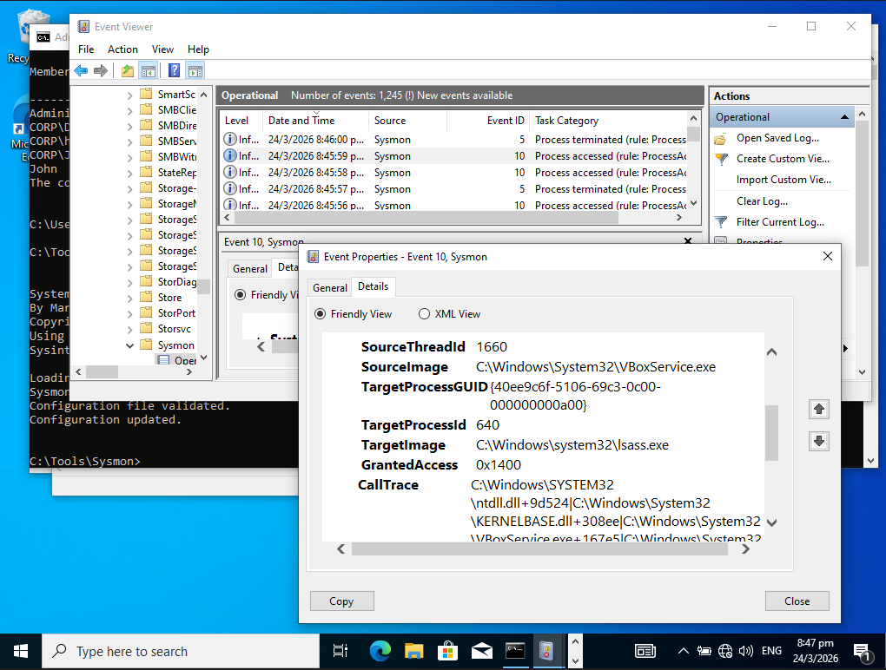

---

## Step 8 — Investigation Correlation

The analyst reconstructed attacker activity by correlating authentication events, privilege escalation behaviour and endpoint telemetry.

- 24/3/2026 8:45:27pm --> Attacker logged on as helpdesk_admin
- 24/3/2026 8:45:36pm --> Process was created and lsass.exe was being used

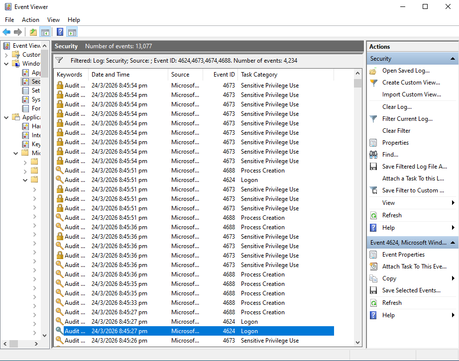

---

### Credential Access Detection Evidence

Sysmon telemetry confirmed process access activity targeting LSASS memory.
Screenshot was given in Step 7's Sysmon Telemetry Analysis.

---

### Incident Impact Assessment

Memory dump artefacts indicated potential exposure of authentication material.
Screenshot was given in Step 6. 

---

## Lab Conclusion

The attacker successfully established a credential harvesting pivot on the compromised workstation. The attacker also can utilise an offline parsing of the LSASS dump to increase attacker dwell time and removing unnecessary footprint in the infrastructure. 

This creates elevated risk of lateral movement and domain privilege escalation in subsequent intrusion phases.

