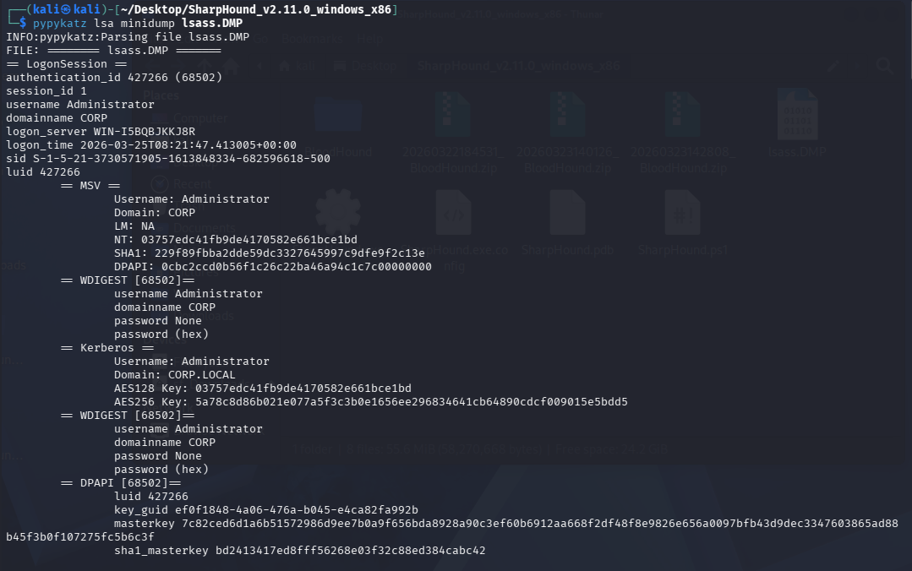
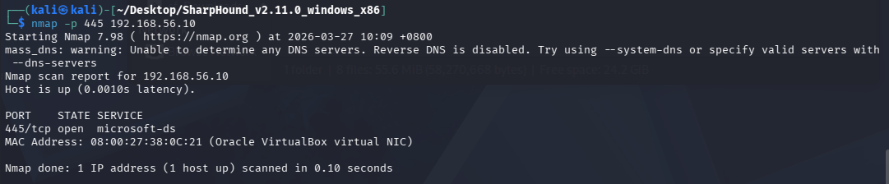
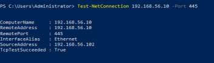
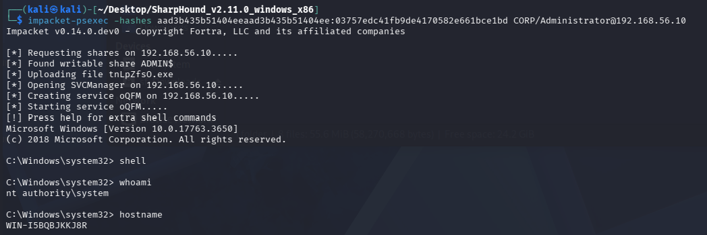
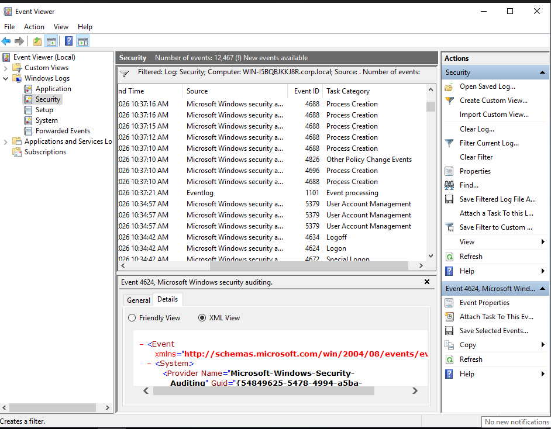

# Phase-2 Incident-02 Lab

## Lateral Movement via Pass-the-Hash to Domain Controller

---

## Objective

Simulate attacker progression from credential harvesting to lateral movement by reusing NTLM authentication material obtained from LSASS memory.

The attacker leverages Pass-the-Hash (PtH) to authenticate to a Domain Controller without using plaintext credentials, demonstrating how identity compromise enables cross-host pivoting.

This lab generates telemetry required for the Phase-2 lateral movement incident report.

---

## 🖥 Lab Topology

* **DC01** — Domain Controller
* **WS01** — Compromised Workstation
* **ATTACKER** — Kali Linux

---

## Step 1 — Extract NTLM Hash from LSASS (On WS01)

Following credential dumping activity in Incident-01, the attacker retrieves NTLM authentication material from LSASS memory and dumps it on KALI.

---

### Reasoning

NTLM hashes function as password-equivalent authentication material.
The attacker does not need to crack the password — possession of the hash is sufficient to authenticate.

This enables stealthier operations by avoiding brute-force or password guessing behaviour.

---

## Step 2 — Establish Target Reachability (From ATTACKER)

The attacker validates connectivity to the Domain Controller over SMB, which is required for remote execution. However, in realistic organization structure, SMB port is often allowed internally. Hence the attacker should also check SMB port availability from the compromised machine (WS01).

From attacker's machine, SMB port is currently open.

from WS01, SMB port is open.

---

### Reasoning

SMB (port 445) is required for remote service execution techniques such as PsExec.

Failure to reach this port prevents lateral movement even if valid credentials are available.

---

## Step 3 — Lateral Movement

### Pass-the-Hash Authentication 

The attacker performs authentication to DC01 using the NTLM hash extracted earlier.
Upon successful authentication, the attacker leverages SMB to create and execute a remote service on DC01.

---

### Reasoning

Instead of submitting a plaintext password, the attacker uses the NTLM hash directly in the authentication process.

The NTLM protocol validates the response generated from the hash, allowing access without exposing or knowing the original password.

This represents **authentication abuse rather than exploitation**.

###  Remote Service Execution via SMB
PsExec operates by:

* Writing a service binary to ADMIN$ share
* Creating a Windows service remotely
* Executing commands under SYSTEM context

This results in full remote command execution on the target system.

---

### Confirm Lateral Movement Success

The attacker validates execution context on the Domain Controller.

---

### Reasoning

Verification confirms:

* The attacker is operating on DC01
* Elevated privileges are obtained (SYSTEM / Administrator)

This indicates successful lateral movement and potential domain compromise.

---

## Step 6 — SOC Analyst Investigation

Following abnormal authentication activity, the SOC analyst investigates security telemetry on DC01.

---

### Security Log Analysis

The analyst reviews authentication events associated with privileged accounts.

---

### Key Observations

* Event ID **4624** — Successful logon
* Logon Type **3** — Network logon
* Source host: **WS01**
* Account: **Administrator**

---

### Reasoning

A workstation initiating administrative authentication to a Domain Controller is highly unusual and indicative of lateral movement.

---

### Privileged Logon Confirmation
---

* Event ID **4672** observed
* Confirms assignment of special privileges

---

## Step 7 — Investigation Correlation

The analyst reconstructs the attack timeline by correlating authentication and execution behaviour.

---

### Timeline Reconstruction

* 25/3/2026 10:34:42 → NTLM-based logon from WS01 to DC01
* 25/3/2026 10:34:42 → Privileged logon assigned
* 25/3/2026 10:37:21 → Remote service execution initiated

---

### Lateral Movement Detection Evidence

* Network logon from non-administrative workstation
* Privileged account used remotely
* Service execution activity on Domain Controller

---

### Incident Impact Assessment

The attacker successfully leveraged stolen authentication material to gain control over the Domain Controller.

This represents a critical escalation point where:

* Domain-wide privilege abuse becomes possible
* Additional persistence mechanisms can be deployed
* Full environment compromise is achievable

---

## Lab Conclusion

The attacker successfully transitioned from credential access to lateral movement using Pass-the-Hash.

This demonstrates how:

* Credential compromise leads directly to network traversal
* NTLM authentication allows reuse of stolen hashes
* Legitimate protocols can be abused for malicious activity

This significantly increases the risk of domain dominance and further attack progression in subsequent phases.

---
