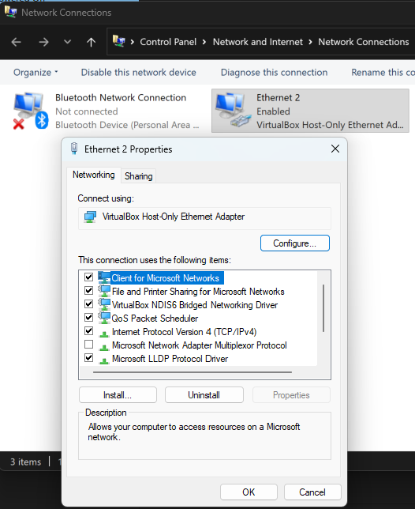
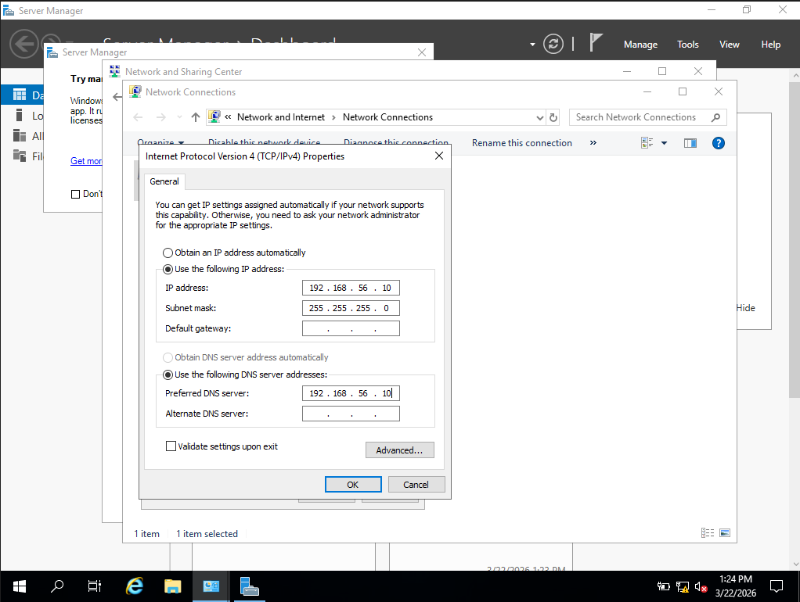
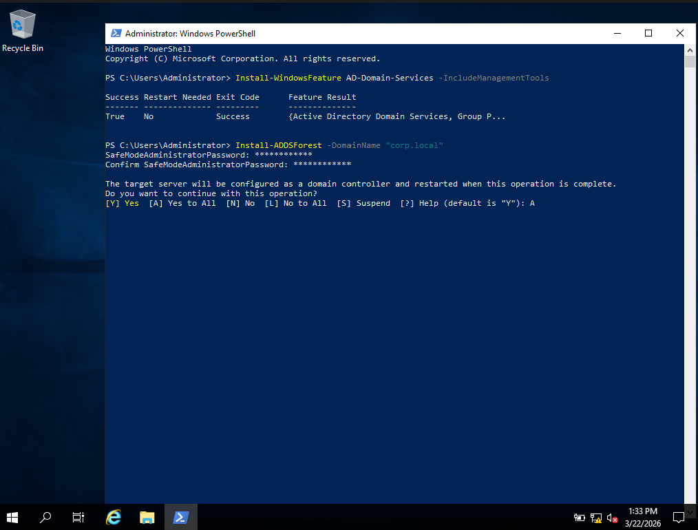
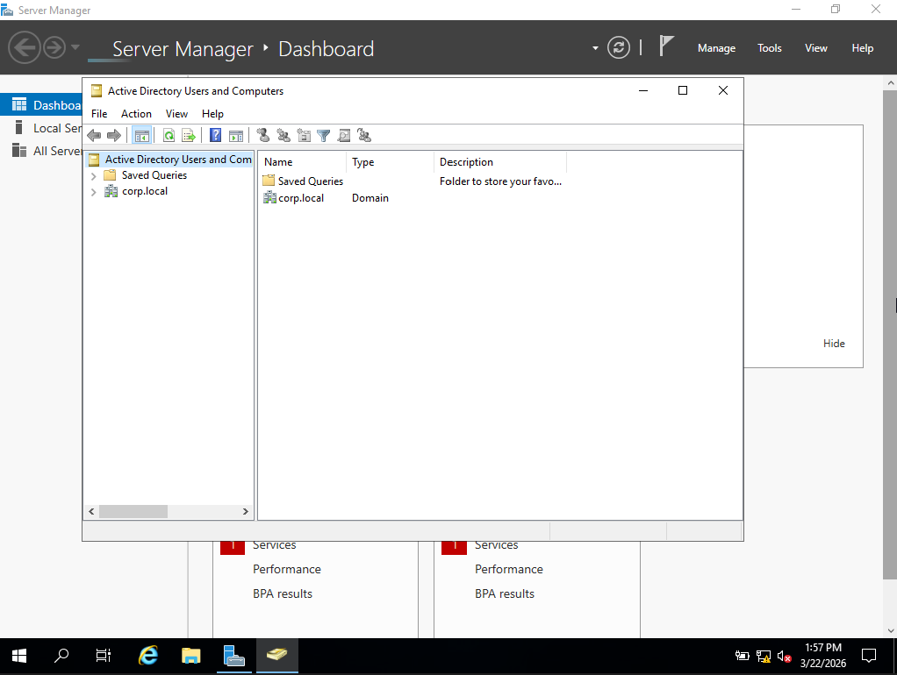
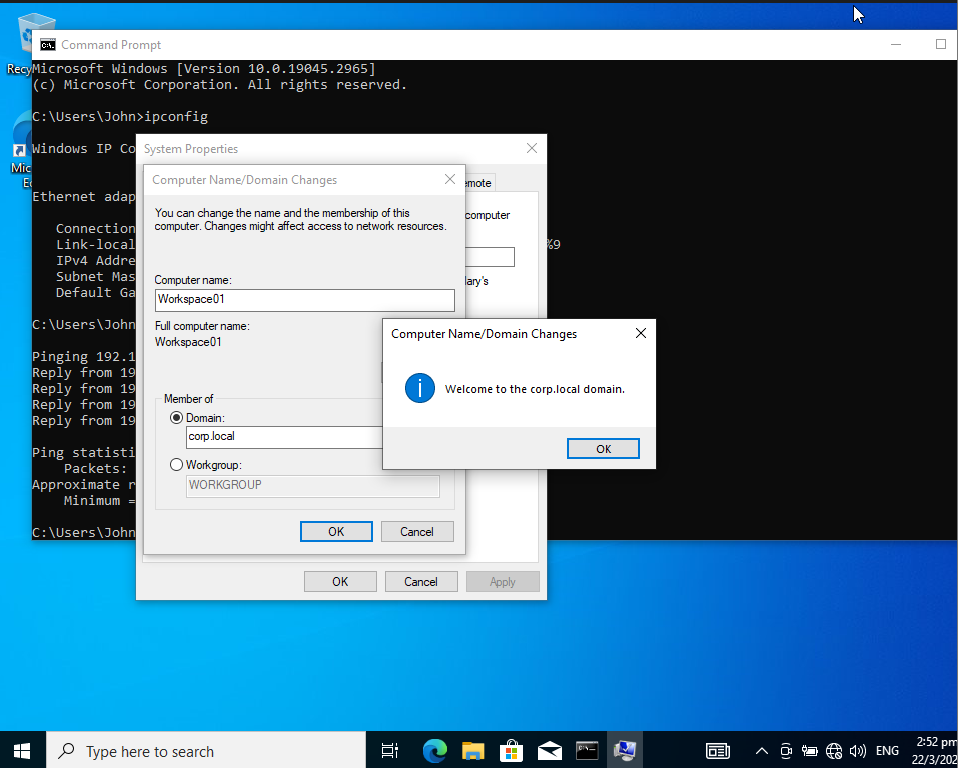
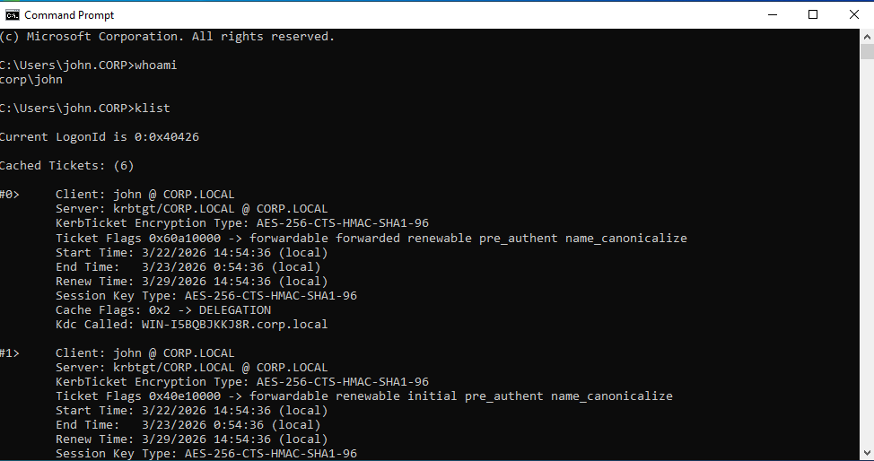

# # Active Directory Identity Attack Path Lab (BloodHound + Kerberos Delegation)

## Lab Objective

Simulate a realistic enterprise identity attack chain starting from a compromised low-privilege domain user and escalating privileges via Kerberos delegation abuse.

The lab demonstrates how attackers enumerate Active Directory trust relationships, identify delegation paths, and impersonate privileged users to pivot deeper into the network.

---

## Lab Architecture

### Network Overview

```
VirtualBox Host-Only Network (192.168.56.0/24)

DC01   → 192.168.56.10  (Domain Controller / KDC / LDAP)
WS01   → 192.168.56.11  (User Workstation)
WEB01  → 192.168.56.20  (Delegated Server Pivot)
KALI   → 192.168.56.30  (Attacker Machine)
```

### Design Rationale

* Single flat subnet to simplify Kerberos communication
* Domain Controller provides authentication services
* Delegated server represents trusted application tier
* Attacker operates from compromised user context

---

## Lab Environment

| Component         | Version                                  |
| ----------------- | ---------------------------------------- |
| Domain Controller | Windows Server 2022                      |
| Workstation       | Windows 10                               |
| Attacker          | Kali Linux                               |
| Tools             | BloodHound, SharpHound, Impacket, Rubeus |

---

## Phase 1: Domain Controller Deployment and Set Up

### Steps

* Create VM DC001
* Configure static IP
* Install Active Directory Domain Services
* Promote forest `corp.local`
* Add John Smith in the AD Domain for WS01 to use
* Add WS01 into AD

### Screenshots

* 
* 
* 
* 
* 

### Key Learning
Active Directory acts as centralized identity authority storing password hashes and Kerberos keys.

---

## Phase 2: Initial Access Simulation

### Assumption

Attacker obtained credentials:

```
corp\john / Password123!
```

### Actions

* Login to WS001
* Verify Kerberos ticket cache
* Discover domain controller

### Commands

```
whoami
klist
nltest /dsgetdc:corp.local
```

### Detection Opportunity

* Unusual login origin
* Kerberos TGT issuance patterns

### Screenshots
* 

---

## Phase 3: Active Directory Enumeration

### Objective

Discover privilege escalation and delegation paths.

### Tool

SharpHound collection:

```
SharpHound.exe -c All
```

### Analysis

Import data into BloodHound and identify shortest path to Domain Admin.

### Screenshot Evidence

* Using Kali to push SharpHound into WS01 

* Node relationship showing GenericWrite / delegation

### Key Learning

Enterprise identity is a graph of trust relationships exploitable by attackers.

---

## Phase 4: Delegation Abuse (RBCD)

### Attack Steps

* Create attacker-controlled machine account
* Modify delegation attribute on target server
* Request service ticket impersonating privileged user

### Example Commands

```
addcomputer.py corp.local/john:Password123 -computer-name FAKE01$
rbcd.py -delegate-from FAKE01$ -delegate-to WEB01$
Rubeus.exe s4u /user:FAKE01$ /impersonateuser:Administrator
```

### Screenshot Evidence

* Machine account creation success
* Delegation attribute modification
* Kerberos ticket cache showing impersonated ticket

### Key Learning

Delegation misconfigurations allow privilege escalation without password cracking.

---

## Phase 5: Privilege Pivot

### Verification

```
dir \\WEB01\c$
```

### Expected Result

Administrative share accessible due to impersonated identity.

### Detection Opportunity

* Event ID 4741 (Machine account creation)
* Event ID 5136 (Directory object modification)
* Event ID 4769 (Service ticket requests spike)

---

## Phase 6: Domain Dominance (Conceptual)

Attacker could proceed to:

* Dump LSASS
* Perform DCSync
* Extract KRBTGT hash
* Forge Golden Ticket

### Key Learning

Identity trust abuse enables domain-wide persistence.

---

## Lessons Learned

* Initial access does not equal domain compromise
* Delegated services form critical trust pivot points
* Active Directory attack paths can be graph-modelled
* Behaviour-based detection is required for Kerberos abuse

---

## Future Improvements

* Introduce VLAN segmentation
* Simulate EDR telemetry
* Implement Sigma detection rules
* Add multi-domain trust scenario