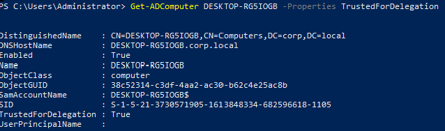

# Unconstrained Delegation Abuse – Identity Exposure Analysis Lab

## Lab Objective

Identify and analyse the security implications of unconstrained Kerberos delegation within an Active Directory environment.

The objective is to understand how delegated systems may act as credential aggregation points and why attackers prioritise such hosts when planning privilege escalation and domain dominance operations.

---

## Environment Context

* Domain: corp.local
* Compromised User Context: corp\john
* Delegated Host Identified: WS02

---

## Delegation Enumeration

From the compromised workstation, delegation configuration was enumerated using:

```
Get-ADComputer -Filter {TrustedForDelegation -eq $True} -Properties TrustedForDelegation
```


*

Enumeration results confirmed that WS02 was configured with unconstrained delegation.

---

## Attack Surface Validation

Network reachability and potential lateral movement feasibility were validated:

```
ping ws02
net view \\ws02
```

This confirmed that the delegated host was accessible from the compromised user workstation.

---

## Identity Graph Confirmation

BloodHound collection was executed to validate delegation exposure within the enterprise identity trust graph.

Delegated hosts were identified as potential escalation targets due to their ability to cache Kerberos Ticket Granting Tickets (TGTs) of authenticated users.

---

## Attacker Tradecraft Interpretation

Unconstrained delegation significantly increases credential exposure risk.
If administrative access is later obtained on the delegated system, attackers may extract reusable Kerberos tickets belonging to privileged users.

This enables:

* privilege escalation preparation
* lateral movement staging
* potential domain compromise operations

---

## Detection Considerations

* Privileged logons to delegated hosts (Event ID 4624)
* Abnormal Kerberos service ticket patterns (Event ID 4769)
* Credential dumping telemetry (LSASS access)
* Lateral movement originating from delegated infrastructure

---

## Key Learning

Delegation misconfiguration does not directly grant attacker privilege escalation.
However, it creates high-value identity exposure points that can be weaponised when combined with administrative access or session hijacking opportunities.
