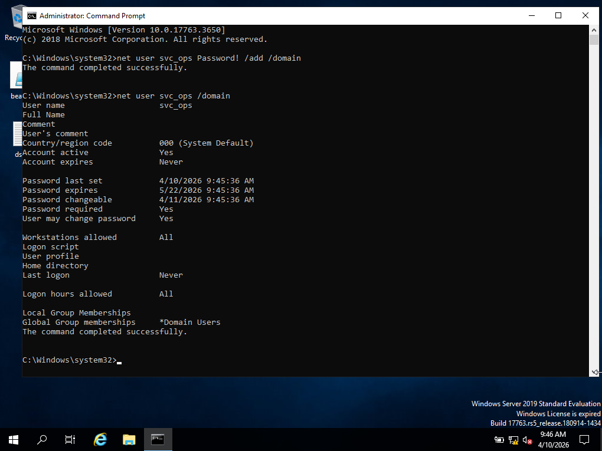
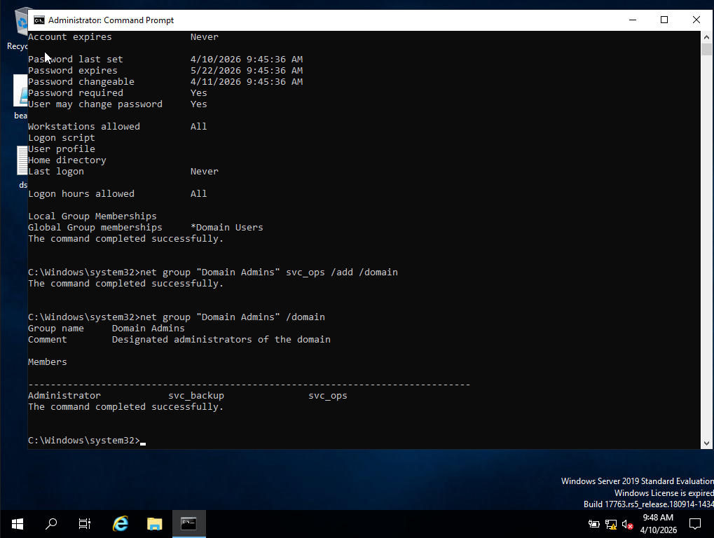
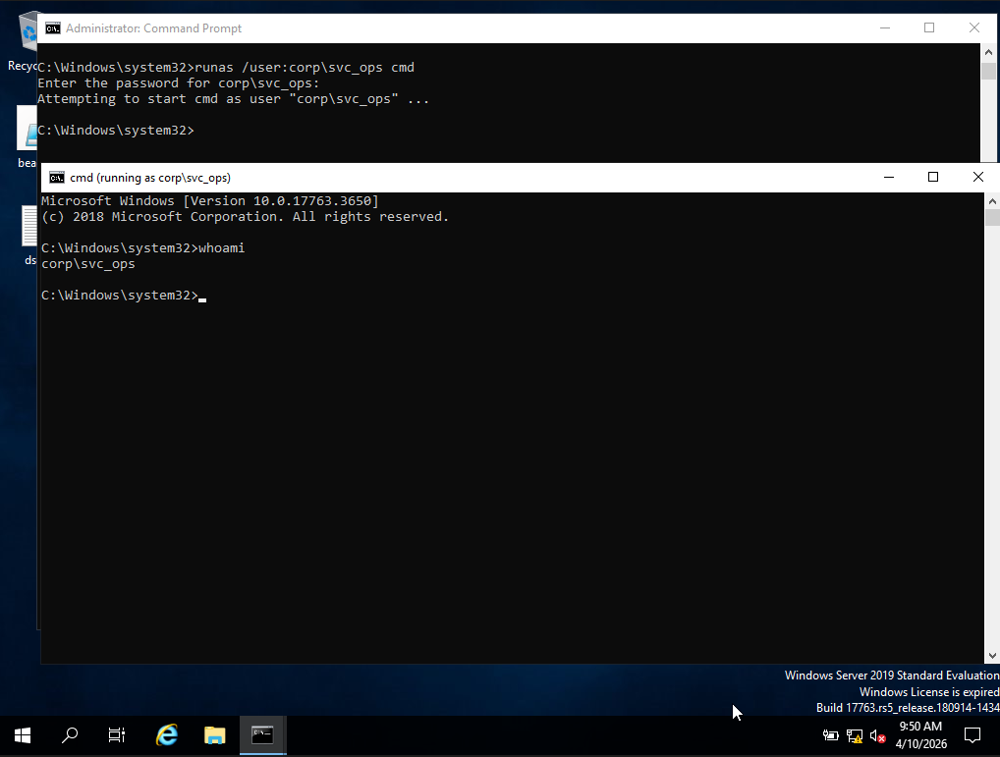
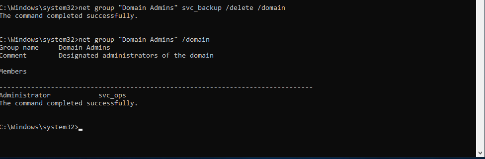
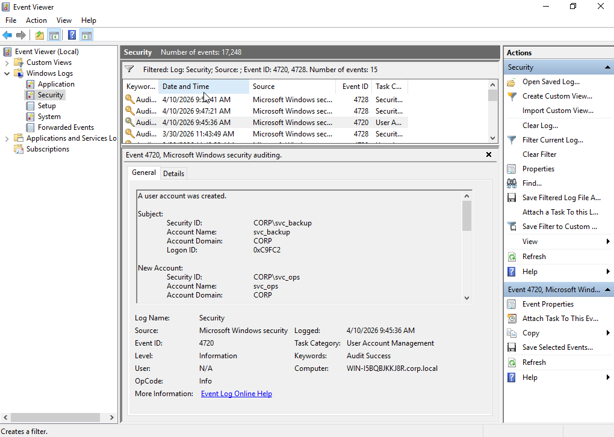
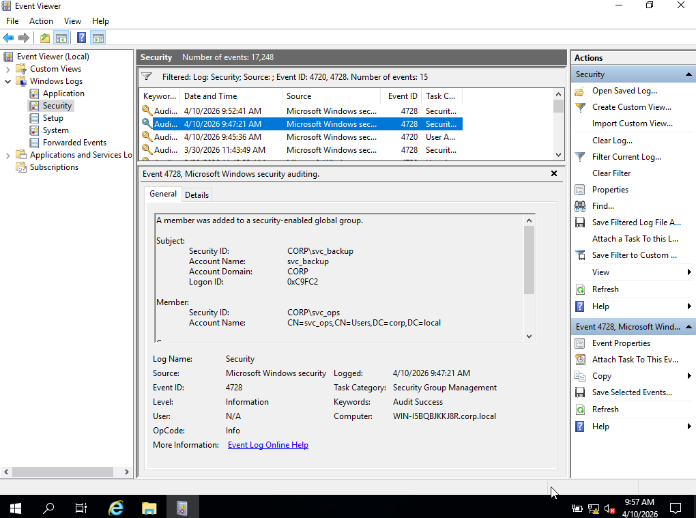

# Phase-3 Incident-03 Lab

## Domain Control via Redundant Identity Persistence

---

## Objective

Simulate attacker transition from persistent access to **durable domain control** by establishing multiple independent privileged identities within Active Directory.

This lab demonstrates how attackers ensure continued access even if one persistence mechanism is removed.

---

## Lab Topology

* **DC01** — Domain Controller
* **WS01** — Previously compromised workstation
* **ATTACKER** — Kali or Windows attack VM

---

## Step 0 — Precondition (From Phase 3)

The attacker has already:

* Established persistence via `svc_backup`
* Achieved Domain Administrator privileges
* Established command-and-control (C2) access

The attacker now aims to ensure **redundant and resilient control over the domain**.

---

## Step 1 — Create Secondary Service Account

### Create new account:

```
net user svc_ops Password! /add /domain
```

---

### Verify account creation:

```
net user svc_ops /domain
```



---

### Reasoning

Attackers create additional service-like accounts to:

* Avoid reliance on a single compromised identity
* Blend into enterprise naming conventions
* Maintain backup access paths

---

## Step 2 — Escalate Account Privileges

### Add `svc_ops` to Domain Admins:

```
net group "Domain Admins" svc_ops /add /domain
```

---

### Verify membership:

```
net group "Domain Admins" /domain
```

Expected:

* `svc_backup`
* `svc_ops`


```

---

### Reasoning

By adding a second account to Domain Admins:

* Attacker introduces **redundancy**
* Detection becomes harder due to multiple privileged identities
* Removal of one account does not remove access

---

## Step 3 — Validate Independent Access

### Run as new account:

```
runas /user:corp\svc_ops cmd
```

---

### Verify identity:

```
whoami
```

Expected:

* `corp\svc_ops`



---


### Reasoning

This confirms:

* Access is independent of original persistence (`svc_backup`)
* Attacker now controls multiple valid identities

---

## Step 4 — Simulate Defender Response

### Remove original account:

```
net group "Domain Admins" svc_backup /delete /domain
```

---

### Verify remaining access:

```
net group "Domain Admins" /domain
```

Expected:

* `svc_ops` still present



---
### Reasoning

This demonstrates:

* Attacker access survives partial remediation
* Defender actions may be insufficient
* Domain control persists despite cleanup

---

## Step 5 — SOC Analyst Investigation

### Open Event Viewer

* `Win + R` → `eventvwr.msc`

---

### Navigate to:

Windows Logs → Security

---

### Check Event ID 4720 (Account Creation)

* `svc_ops` created



---

### Check Event ID 4728 (Group Membership)

* `svc_ops` added to Domain Admins


---


### Detection Insight

Sequence indicates:

* Creation of secondary privileged identity
* Privilege escalation via group modification
* Continued administrative access after partial remediation

---

## Step 6 — Investigation Correlation

Reconstruct attacker activity:

* Secondary account created
* Elevated to Domain Admin
* Independent privileged access established
* Redundant persistence maintained

---

### Timeline 

* 4/10/2026 9:45:36AM → Account created (4720)
* 4/10/2026 9:47:21AM → Added to Domain Admins (4728)

---

### Detection Insight

This activity demonstrates:

* Transition from persistence to **resilient domain control**
* Use of multiple identities to evade remediation
* Increased attacker survivability within environment

---

## Lab Conclusion

The attacker successfully established **redundant domain-level access** by introducing a secondary privileged account (`svc_ops`) alongside the original persistence mechanism.

This ensures:

* Continued access even if one account is removed
* Increased difficulty in remediation
* Full control over identity infrastructure

This phase transitions the attack from:

**Active Control → Durable Domain Control**

---
