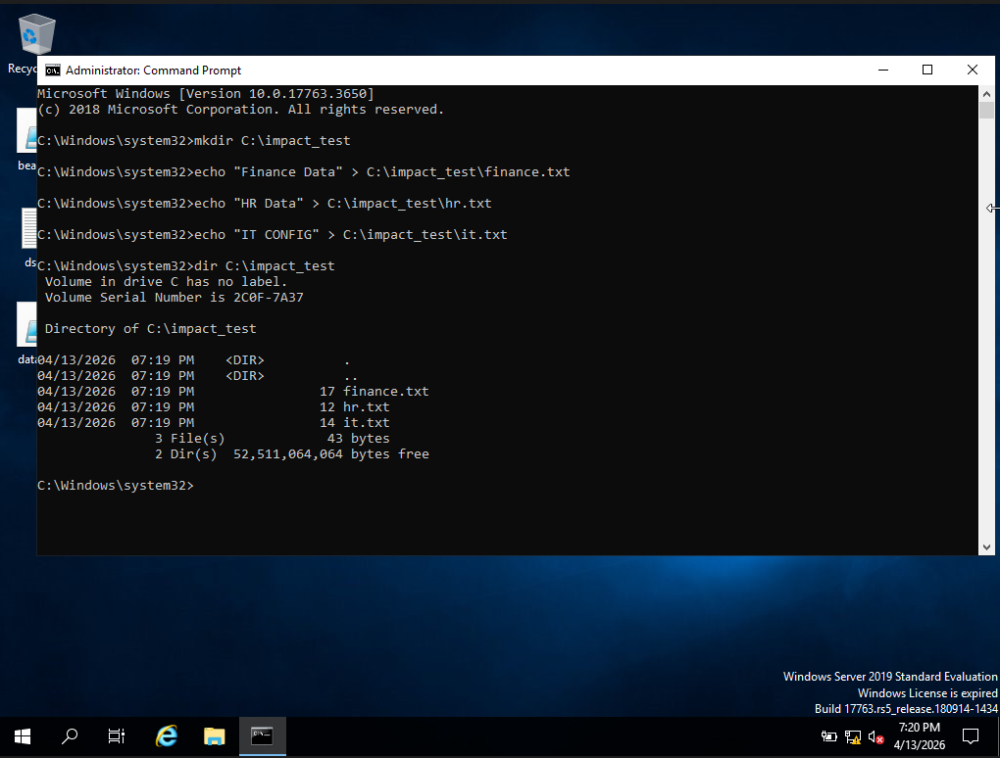
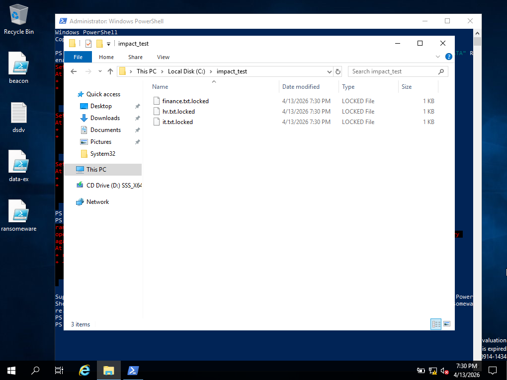
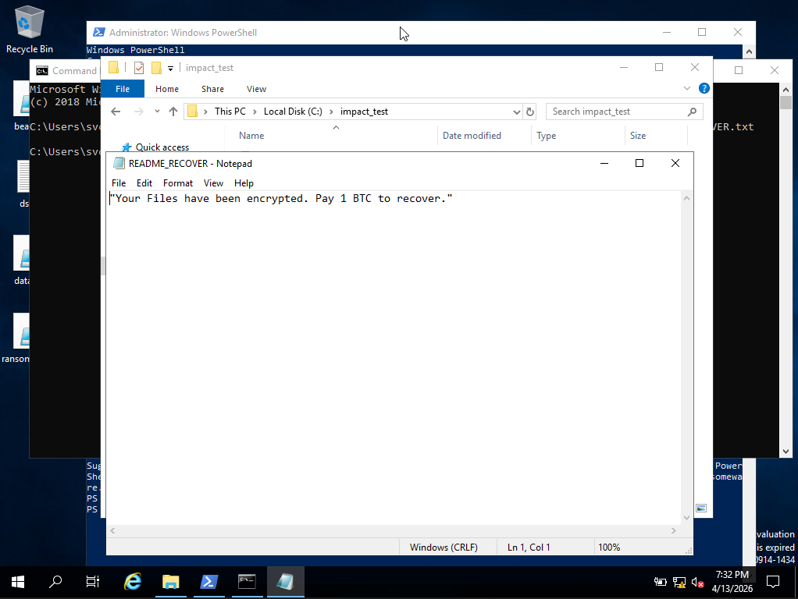
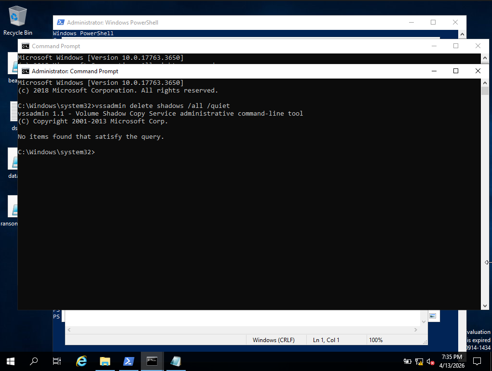
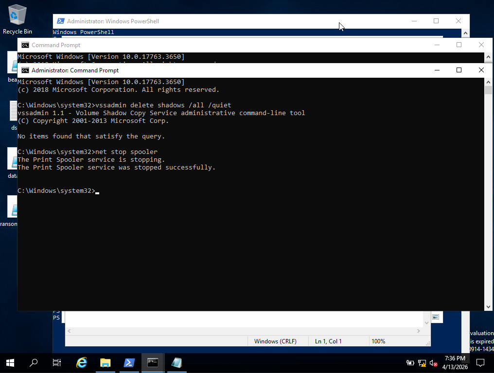

# Phase-4 Incident-02 Lab

## Impact Simulation via Ransomware Tradecraft (Safe Emulation)

---

## Objective

Simulate attacker behaviour during the **impact phase** by emulating ransomware tradecraft using native system tools.

This lab demonstrates how attackers:

* Modify large volumes of files
* Disrupt system recovery mechanisms
* Leave ransom artifacts
* Cause visible operational impact

without using actual ransomware binaries.

---

## Lab Topology

* **DC01** — Domain Controller (compromised)
* **ATTACKER** — C2 established

---

## Step 0 — Precondition (From Phase 4 Lab 1)

The attacker has:

* Domain Administrator access
* Persistent C2 channel
* Data exfiltration capability

The attacker now transitions to **impact operations**.

---

## Step 1 — Prepare Target Files

### Create multiple files for simulation:

```cmd
mkdir C:\impact_test
echo "Finance Data" > C:\impact_test\finance.txt
echo "HR Data" > C:\impact_test\hr.txt
echo "IT Config" > C:\impact_test\it.txt
```

---

### Verify:

```cmd
dir C:\impact_test
```


---

### Reasoning

Attackers target:

* Business-critical files
* Shared directories
* User data

---

## Step 2 — Simulate Mass “Encryption” (File Modification)

### Run:

```powershell
Get-ChildItem C:\impact_test -File | ForEach-Object {
    Set-Content $_.FullName "ENCRYPTED DATA"
    Rename-Item $_.FullName ($_.FullName + ".locked")
}
```

---

### Verify:

```cmd
dir C:\impact_test
```

Expected:

* `.locked` files
* Original content replaced


```

---

### Reasoning

This simulates:

* File encryption behaviour
* Mass modification
* Loss of original data

---

## Step 3 — Drop Ransom Note

```cmd
echo "Your files have been encrypted. Pay 1 BTC to recover." > C:\impact_test\README_RECOVER.txt
```


---

### Reasoning

Ransom notes:

* Communicate attacker intent
* Provide payment instructions
* Confirm successful impact

---

## Step 4 — Disable Recovery Mechanisms

### Run:

```cmd
vssadmin delete shadows /all /quiet
```

---

### Reasoning

Attackers delete shadow copies to:

* Prevent file recovery
* Increase pressure on victim
* Ensure impact is irreversible

However, no shadow copies were present on the system.

---

## Step 5 — Simulate System Impact

Optional (safe disruption):

```cmd
net stop spooler
```

---

### Reasoning

Attackers may:

* Stop services
* Disrupt operations
* Increase urgency for ransom

---

## Step 6 — SOC Analyst Investigation

### Check File Activity

* Large number of files modified
* File extensions changed (`.locked`)

---

### Check Process Execution

* PowerShell execution for bulk file operations
* `vssadmin` usage

---

### Check Event Logs

* **4688** → PowerShell execution
* **4688** → `vssadmin.exe` execution

---

### Detection Insight

Sequence indicates:

* Bulk file modification
* Recovery mechanism tampering
* Ransom artifact deployment

---

## Step 7 — Investigation Correlation

Reconstruct attacker activity:

* Files targeted and modified
* Ransom note deployed
* Shadow copies deleted
* Services disrupted

---

### Timeline Example

* 4/13/2026 19:30:00 → Files created
* 4/13/2026 19:31:00  → Bulk modification (encryption simulation)
* 4/13/2026 19:32:00 → Ransom note dropped
* 4/13/2026 19:34:00→ Shadow copies deleted
* 4/13/2026 19:35:00 → Service disruption

---

### Detection Insight

This activity reflects:

* Transition from stealth → impact
* Clear attacker intent
* High-confidence malicious behaviour

---

## Lab Conclusion

The attacker successfully simulated a ransomware-style impact by modifying files, disabling recovery mechanisms, and deploying ransom artifacts.

This demonstrates how attackers:

* Leverage native tools
* Avoid traditional malware detection
* Cause significant operational disruption

This phase transitions the attack from:

**Data Theft → Operational Impact**

---
